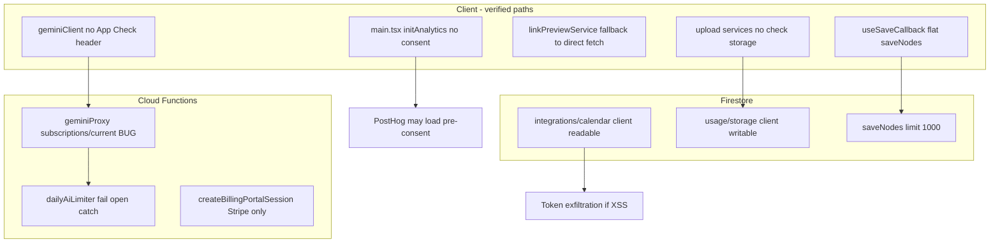
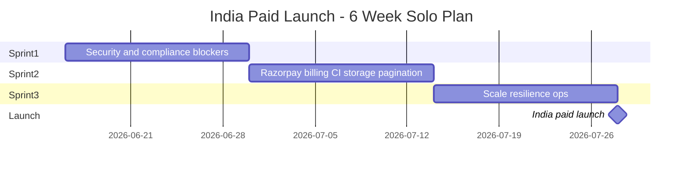
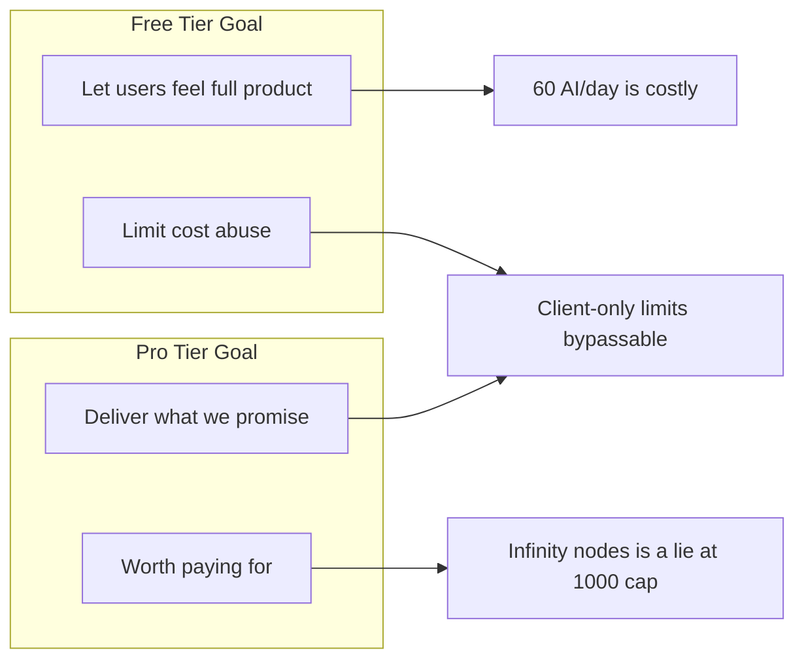

# ActionStation Commercial Launch Readiness (Live Code Audit)

**Method:** Every finding below was verified by reading source files, grep across the repo, and inspecting CI/deploy workflows. Roadmap markdown (`plans/PRODUCTION-LAUNCH-PLAN.md`, `CLAUDE.md`, etc.) was **not used** as evidence — only code paths count.

**Audit date:** June 2026

---

## Executive Verdict

| Dimension | Rating | Evidence basis |
|-----------|--------|----------------|
| Core product | Ready | `App.tsx`, canvas/workspace/AI/KB modules, onboarding, landing routes |
| Security architecture | Strong foundation | `firestore.rules`, layered `functions/src/*`, structural tests |
| Security wiring | Broken in places | App Check gaps, calendar token exposure, client bypass paths |
| Monetization backend | Implemented | 20 Cloud Functions in `functions/src/index.ts`, webhooks with HMAC |
| Monetization UX | Broken for Razorpay users | UI pays via Razorpay, manages via Stripe portal |
| Legal / consent | Partial — blocker | Pages exist; analytics runs before consent |
| Scale | Cliff at 1,000 docs | `FIRESTORE_QUERY_CAP = 1000` in save/load/delete-sync |
| CI/CD | Client strong, server gap | `ci.yml` runs root tests; `functions/` tests never in CI |
| Deploy pipeline | Functions + hosting only | `deploy.yml` — no `firestore:rules` or `storage:rules` deploy |

**Verdict:** Not ready for paid public launch. Closed beta possible after P0 fixes. India-first paid launch needs P0 + P1. Global SaaS needs P0–P2.

---

## What Exists Today (Verified in Code)

### Product surface

- **Landing page** — lazy-loaded in [`src/App.tsx`](src/App.tsx); unauthenticated `/` renders `LandingPage`
- **Legal** — `/terms`, `/privacy` routes in `App.tsx`; content in [`TermsContent.tsx`](src/features/legal/components/terms/TermsContent.tsx), [`PrivacyContent.tsx`](src/features/legal/components/privacy/PrivacyContent.tsx)
- **Cookie banner** — [`CookieConsentBanner.tsx`](src/features/legal/components/CookieConsentBanner.tsx) in `App.tsx`
- **Onboarding** — `OnboardingWalkthrough` in authenticated shell
- **Auth** — Google OAuth only (`signInWithGoogle` in [`authService.ts`](src/features/auth/services/authService.ts)); Turnstile gate in [`LoginPage.tsx`](src/features/auth/components/LoginPage.tsx) via [`useTurnstile.ts`](src/features/auth/hooks/useTurnstile.ts)
- **Account deletion** — Settings → Account → [`deleteAccount()`](src/features/auth/services/authService.ts) calls `onUserDeleted` callable then `deleteUser`
- **GDPR export** — [`useGdprExport.ts`](src/features/workspace/hooks/useGdprExport.ts) + workspace JSON export in Account settings

### Payments (backend complete)

Exported from [`functions/src/index.ts`](functions/src/index.ts):

- `createCheckoutSession`, `stripeWebhook`, `createBillingPortalSession` (Stripe)
- `createRazorpayOrder`, `razorpayWebhook` (Razorpay)
- Subscription SSOT writer: [`subscriptionWriter.ts`](functions/src/utils/subscriptionWriter.ts) → `users/{uid}/subscription/current`
- Client reader: [`subscriptionService.ts`](src/features/subscription/services/subscriptionService.ts) → same path
- Firestore rules block client writes to `subscription/{subId}` ([`firestore.rules`](firestore.rules) lines 31–34)

### Free tier (client + partial server)

SSOT constants in [`tierLimits.ts`](src/features/subscription/types/tierLimits.ts): 5 workspaces, 12 nodes, 60 AI/day, 50 MB storage.

Structural test [`tierLimits.structural.test.ts`](src/__tests__/tierLimits.structural.test.ts) enforces guards are wired to `useWorkspaceOperations`, `useNodeCreationGuard`, `useNodeGeneration`, and `geminiProxy`.

### Security layers (server)

`geminiProxy` documents 9 layers in [`functions/src/geminiProxy.ts`](functions/src/geminiProxy.ts): bot → IP limit → auth → user limit → body cap → prompt filter → token cap → output scan → security log.

App Check verified on: `geminiProxy`, `fetchLinkMeta`, `proxyImage`, `createCheckoutSession`, `createBillingPortalSession`, `createRazorpayOrder`.

### CI guardrails (client)

[`.github/workflows/ci.yml`](.github/workflows/ci.yml): typecheck, lint (0 warnings), test, npm audit, Gitleaks, Gemini key isolation, Lighthouse.

38 structural test files under `src/__tests__/` (query caps, CSP, tier wiring, webhook signatures, etc.).

---

## Failure Architecture (Live Wiring)



---

## P0 — Confirmed Bugs / Blockers (Code Evidence)

### 1. Pro users incorrectly rate-limited on AI

**Only occurrence of wrong path in entire repo:**

```87:88:functions/src/geminiProxy.ts
    const tierSnap = await getFirestore().doc(`users/${uid}/subscriptions/current`).get();
    const tier = (tierSnap.data() as Record<string, unknown> | undefined)?.tier as string | undefined;
```

**Correct path used everywhere else:** `subscription/current` (singular) in `subscriptionWriter.ts`, `subscriptionService.ts`, `createBillingPortalSession.ts`.

**Edge case:** Pro user who paid via Stripe or Razorpay webhook → client shows Pro → server still applies `checkAndIncrementDailyAi` at 60/day because tier doc is never found.

**Why it shipped:** `functions/package.json` has `npm run check` (lint+test+build) but [`.github/workflows/ci.yml`](.github/workflows/ci.yml) and [`deploy.yml`](.github/workflows/deploy.yml) never run it. Deploy only runs `npm run build` in `functions/`, not tests.

---

### 2. App Check required server-side, missing on critical clients

**Server requires App Check:**

- `geminiProxy.ts` line 225: `verifyAppCheckToken(req)` → 401 if missing
- `fetchLinkMeta.ts` line 141: same
- `proxyImage.ts` line 123: same

**Clients that send App Check:** `useCheckout.ts`, `useBillingPortal.ts`, `useRazorpayCheckout.ts` via `getAppCheckToken()`.

**Clients that do NOT:**

```111:124:src/features/knowledgeBank/services/geminiClient.ts
async function callViaProxy(body: GeminiRequestBody): Promise<GeminiCallResult> {
    const token = await getAuthToken();
    ...
    const response = await fetch(url, {
        method: 'POST',
        headers: {
            'Content-Type': 'application/json',
            'Authorization': `Bearer ${token}`,
        },
```

```71:78:src/features/canvas/services/linkPreviewService.ts
        const response = await fetch(deps.getEndpointUrl(), {
            method: 'POST',
            headers: {
                'Content-Type': 'application/json',
                'Authorization': `Bearer ${token}`,
            },
```

**Edge cases:**
- Enable App Check enforcement in Firebase Console → **all AI and link previews return 401**
- Proxy 401/502 triggers direct Gemini fallback if `VITE_GEMINI_API_KEY` set (`geminiClient.ts` lines 90–96) — bypasses prompt filter, rate limits, cost controls
- Link preview falls back to **direct browser fetch** on any proxy failure (`linkPreviewService.ts` lines 81–97) — bypasses server SSRF controls in `urlValidator.ts`
- `proxyImage` requires App Check but `` tags cannot send headers — image previews break when enforcement is on

---

### 3. Google Calendar refresh tokens readable by client

`calendarAuth.ts` writes tokens to Firestore:

```68:78:functions/src/calendarAuth.ts
        await getFirestore()
            .collection('users').doc(uid)
            .collection('integrations').doc('calendar')
            .set({
                refreshToken: tokens.refresh_token,
                accessToken: tokens.access_token,
```

`firestore.rules` allows client read+write:

```75:77:firestore.rules
      match /integrations/{integrationId} {
        allow read, write: if request.auth != null && request.auth.uid == userId;
      }
```

`calendarEvents.ts` comment says tokens never reach client, but any authenticated Firestore SDK read exposes them.

**Edge case:** XSS in TipTap/markdown rendering, malicious browser extension, or compromised session → long-lived Google refresh token exfiltration → calendar data breach beyond ActionStation.

---

### 4. Data integrity cliff at 1,000 nodes/edges

```7:7:src/config/firestoreQueryConfig.ts
export const FIRESTORE_QUERY_CAP = 1000;
```

Used in `saveNodes`, `saveEdges`, `loadNodes`, `loadEdges`, `deleteWorkspace` sync, `tileLoader`, `tiledNodeWriter`, `gdprExportService`.

`saveNodes` only compares against first 1,000 existing docs:

```167:174:src/features/workspace/services/workspaceService.ts
export async function saveNodes(...) {
    const existingSnapshot = await getDocs(query(nodesRef, limit(FIRESTORE_QUERY_CAP)));
    ...
    const deletedNodeData = existingSnapshot.docs
        .filter((d) => !currentIds.has(d.id))
```

`loadNodes` logs warning at cap but still returns truncated set (line 232–233).

**Pro tier advertises unlimited nodes** (`PRO_TIER_LIMITS` in `tierLimits.ts`) but flat storage path cannot handle it.

**Spatial chunking exists but is NOT on autosave path:**
- `useTiledSaveCallback.ts` exists
- `useAutosave` → `useSaveCallback` only (grep: `useTiledSaveCallback` referenced only in its own file + tests + migration)
- `spatialChunkingEnabled` flag read in `useWorkspaceLoader` but does not switch save path

**Edge cases:**
- User with 1,200 nodes deletes 50 locally → save may delete "orphan" docs from unseen 200 → **mass accidental deletion**
- GDPR full export truncates at 1,000 nodes per workspace
- Dense tile with 1,000+ nodes truncates silently (`tileLoader.ts` warns only)

---

### 5. Free-tier limits bypassable (except AI)

| Resource | Client guard location | Server/rules enforcement |
|----------|----------------------|--------------------------|
| Workspaces (5) | `useWorkspaceOperations.ts` | `firestore.rules`: unlimited `workspaces` writes for owner |
| Nodes (12) | `useNodeCreationGuard.ts` | Same for `nodes/{nodeId}` — create allowed when `resource == null` without `userId` validation |
| AI (60/day) | `useNodeGeneration.ts` + toast | `geminiProxy` + `dailyAiLimiter` (server) |
| Storage (50 MB) | `limitChecker` logic exists | **Zero** `check('storage')` call sites; `usage/storage` client-writable |

`storageUsageService.ts` explicitly documents client-writable counter:

```8:9:src/features/subscription/services/storageUsageService.ts
 * Firestore path: users/{userId}/usage/storage
 * Security rule: client read + write allowed (no sensitive data).
```

Upload paths call `addStorageUsage` but never check limit first: `imageUploadService.ts`, `documentUploadService.ts`, `storageService.ts`.

**Edge cases:**
- Script kiddie with Firebase SDK writes 10,000 nodes → Firestore bill explosion
- Reset `usage/storage` to `{totalBytes: 0}` → bypass 50 MB gate (per-file Storage rules still cap 5–15 MB per upload)
- `VITE_DEV_BYPASS_SUBSCRIPTION=true` grants Pro client-side — not in `deploy.yml` (verified by `deployWorkflow.structural.test.ts`) but dangerous in misconfigured builds

---

### 6. `dailyAiLimiter` fails open

```52:55:functions/src/utils/dailyAiLimiter.ts
    } catch (err) {
        logger.error('[dailyAiLimiter] transaction failed', { userId, err });
        return true;
    }
```

**Edge case:** Firestore transaction contention or outage → unlimited free AI generations → Gemini cost spike.

---

### 7. Analytics consent violation (GDPR)

**PostHog initializes without consent:**

```21:22:src/main.tsx
scheduleIdle(() => { void initSentry(); });
scheduleIdle(() => { initAnalytics(); });
```

`initAnalytics()` in [`analyticsService.ts`](src/shared/services/analyticsService.ts) does not check `consentService.hasConsented()`.

**Consent only on banner accept:**

```47:50:src/features/legal/hooks/useConsentState.ts
    const accept = useCallback(() => {
        consentService.accept();
        dispatch({ type: 'ACCEPT' });
        initAnalytics();
```

**Reject does not opt out if analytics already started:**

```53:56:src/features/legal/hooks/useConsentState.ts
    const reject = useCallback(() => {
        consentService.reject();
        dispatch({ type: 'REJECT' });
    }, []);
```

No `opt_out_capturing()` call on reject (though `analyticsService.ts` exposes it).

**Sign-in tracks without consent:**

```47:48:src/features/auth/services/authService.ts
        identifyUser(user.id);
        trackSignIn();
```

**Privacy policy promises UI that does not exist:**

```78:78:src/features/legal/components/privacy/PrivacyContent.tsx
... You can change your analytics preference at any time in Settings → Privacy.
```

Settings tabs in [`SettingsPanelContent.tsx`](src/app/components/SettingsPanel/SettingsPanelContent.tsx): appearance, canvas, toolbar, account, keyboard, about — **no Privacy tab**.

**Edge case:** EU user visits site → PostHog loads on idle before banner interaction → regulatory exposure. DNT auto-reject in `useConsentState` does not prevent `main.tsx` init.

---

### 8. Turnstile blocked by CSP when enabled

`useTurnstile.ts` loads `https://challenges.cloudflare.com/turnstile/v0/api.js` (line 53).

`firebase.json` CSP `script-src` and `frame-src` — **no `challenges.cloudflare.com`** (grep confirmed zero matches in `firebase.json`).

Missing site key → CAPTCHA skipped:

```117:120:src/features/auth/hooks/useTurnstile.ts
        if (!siteKey) {
            logger.warn('VITE_TURNSTILE_SITE_KEY not configured, skipping CAPTCHA');
            return true;
        }
```

`VITE_TURNSTILE_SITE_KEY` is in `deploy.yml` build env but **not** in [`envValidation.ts`](src/config/envValidation.ts) `REQUIRED_VARS` and **not** in deploy secret validation loop (lines 35–37 only list 9 vars).

**Edge case:** Secret set in GitHub → Turnstile script blocked by CSP → login CAPTCHA fails silently or breaks login flow.

---

## P1 — Required Before Taking Money at Scale

### Payment UX split (verified component wiring)

**Upgrade/checkout — Razorpay only in UI:**

Grep `useRazorpayCheckout` in `.tsx` files: `AccountSection.tsx`, `Sidebar.tsx`, `PinWorkspaceButton.tsx`.

`useCheckout.ts` (Stripe) — **zero** `.tsx` imports.

**Manage billing — Stripe only:**

`AccountSection.tsx` → `useBillingPortal` → `createBillingPortalSession` → requires `gatewayCustomerId` or `stripeCustomerId` (Stripe customer ID).

Razorpay `payment.captured` handler writes empty customer ID:

```276:281:functions/src/razorpayWebhook.ts
    await writeSubscription(userId, {
        ...
        gatewayCustomerId: '',
        gatewaySubscriptionId: null,
```

**Edge case:** User pays ₹ via Razorpay → sees Pro → clicks "Manage Billing" → `createBillingPortalSession` returns 404 "No subscription found" or Stripe error.

**Razorpay billing model mismatch:**

- UI uses `PRO_MONTHLY_PLAN_ID` (`subscription.ts` line 30)
- `createRazorpayOrder.ts` creates **one-time Orders**, not Razorpay Subscriptions
- `handlePaymentCaptured` grants **365 days** Pro (line 274), not monthly

`subscription.ts` defines `provider?: 'stripe' | 'razorpay'` for portal routing — **`useBillingPortal.ts` ignores provider entirely**.

---

### Account deletion does not cancel subscriptions

```133:139:src/features/auth/services/authService.ts
export async function deleteAccount(): Promise<void> {
    ...
    const cleanupFn = httpsCallable(functions, 'onUserDeleted');
    await cleanupFn({});
```

`onUserDeleted.ts` deletes Firestore `users/{uid}` recursively and Storage prefix — **no Stripe/Razorpay API calls**.

**Edge case:** User deletes account while Pro → Firestore subscription doc gone → Stripe/Razorpay continues charging → chargeback risk.

---

### Deploy pipeline gaps (verified in workflows)

| What deploy.yml does | What it does NOT do |
|---------------------|---------------------|
| `npm run check` (root only) | `cd functions && npm run check` |
| `firebase deploy --only functions` | `firestore:rules`, `storage:rules`, `firestore:indexes` |
| Validates 9 env secrets | Does not validate `VITE_SENTRY_DSN`, `VITE_POSTHOG_KEY`, `VITE_STRIPE_PUBLISHABLE_KEY`, `VITE_TURNSTILE_SITE_KEY` in MISSING loop (they are in build env only) |
| Deploys to `live` channel on push to `main` | No staging environment |

`validateProductionEnv()` in `main.tsx` line 14 — return value discarded; app boots even with missing vars.

---

### Webhook idempotency non-atomic

```18:21:functions/src/utils/webhookIdempotency.ts
export async function checkIdempotency(eventId: string): Promise<boolean> {
    const doc = await db.collection(COLLECTION).doc(eventId).get();
    return doc.exists;
}
```

Separate `recordEvent()` — not a transaction. Race: two concurrent deliveries both pass check.

Razorpay event ID construction:

```115:115:functions/src/razorpayWebhook.ts
        const eventId = `${payload.event}_${subId ?? payId ?? crypto.randomUUID()}`;
```

**Edge case:** Missing `subId`/`payId` → new UUID per retry → duplicate `writeSubscription` calls (mostly idempotent but audit trail wrong; edge-case double-grant if handlers aren't idempotent).

---

### Infrastructure scripts exist but are not in deploy pipeline

Verified by reading files only:

- [`scripts/setup-cloud-armor.sh`](scripts/setup-cloud-armor.sh) line 40: `DOMAIN="actionstation.so"`
- [`functions/src/utils/domainConfig.ts`](functions/src/utils/domainConfig.ts) line 18: `https://www.actionstation.in`

Domain mismatch in repo — WAF script would provision SSL for wrong domain if run without editing.

`health` function exists (`functions/src/health.ts`) — no uptime monitor configuration anywhere in repo (no Checkly/BetterUptime config files).

Cloud Armor/monitoring: scripts + structural tests (`cloudArmorCoverage.structural.test.ts`, `monitoringCoverage.structural.test.ts`) enforce function exports match script SERVICE arrays — **cannot verify GCP execution from code**.

---

## P2 — Edge Cases Under Real Public Load

### Multi-tab silent data loss

`useSaveCallback.ts` lines 72–74: follower tabs update `workspaceCache` only, skip Firestore.

`MultiTabBanner.tsx` warns follower but **does not block editing** in canvas.

**Edge case:** User edits in Tab B (follower), closes Tab B → changes lost. Tab A (leader) never had those edits.

`useTiledSaveCallback` has **no** `useTabRoleStore` check — future spatial chunking would allow dual-writer corruption.

---

### Subscription read fails open

```83:85:src/features/subscription/services/subscriptionService.ts
    } catch {
        return DEFAULT_SUBSCRIPTION;
    }
```

**Edge case:** Transient Firestore error → paying user temporarily treated as free → Pro features hidden, upgrade prompts shown.

---

### AI upgrade CTA is a no-op

```46:46:src/features/ai/hooks/useNodeGeneration.ts
                    { label: strings.subscription.upgradeCta, onClick: () => { /* upgrade handler handled by parent */ } },
```

Empty handler — user hits AI limit, taps upgrade in toast, nothing happens.

---

### Shared snapshots world-readable

```5:8:storage.rules
    match /shared-snapshots/{snapshotId} {
      allow read: if true;
      allow write: if request.auth != null
```

**Edge case:** User shares canvas link with sensitive notes → anyone with UUID can read for snapshot lifetime.

---

### Calendar / onCall functions lack bot+IP layers

`calendarAuth.ts`, `calendarEvents.ts`, `workspaceBundle.ts` use `onCall` with auth + user rate limit — no `detectBot` or `checkIpRateLimit` unlike `geminiProxy`.

**Edge case:** Authenticated abuse at scale (many accounts) still possible.

---

### `verifyTurnstile` has IP rate limit only

No bot detection, no App Check, no auth (by design for pre-login). Relies on Turnstile + IP limit.

---

### Performance

- `loadNodes` loads up to 1,000 nodes into memory per workspace open
- `CanvasView.tsx` uses `onlyRenderVisibleElements` (structural test enforced)
- Web Worker client falls back to sync after crashes (`knowledgeWorkerClient.ts`)
- `initWebVitals()` in `main.tsx` — no wiring to PostHog/Sentry in production code path

---

### GDPR export incomplete

`gdprExportService.ts` uses `loadNodes`/`loadEdges` (1,000 cap). Does not include subscription doc, calendar integration, usage counters, or Storage file binaries.

---

### No E2E tests

No Playwright/Cypress in `package.json` dependencies. Testing is Vitest + jsdom + structural tests.

---

## What Is Genuinely Strong (Code-Verified)

1. **Firestore deny-all default** + server-only `_webhookEvents`, `_rateLimits`, `_ipRateLimits`
2. **Subscription client write blocked** — webhooks use Admin SDK
3. **`aiDaily` server-write only** in rules (line 82–84)
4. **Webhook HMAC** — Stripe `constructEvent`, Razorpay HMAC-SHA256 in `razorpayWebhook.ts`
5. **Prompt injection pipeline** — `textNormalizer.ts` + `promptFilter.ts` with tests
6. **Base64 stripped before Firestore** — structural test `noBase64InFirestore.structural.test.ts`
7. **Gemini key isolation** — CI job + only `geminiClient.ts` may reference `VITE_GEMINI_API_KEY`
8. **CSP in HTTP headers only** — `cspCompleteness.structural.test.ts`
9. **Tab leader election** — `tabLeaderService.ts` + `useSaveCallback` gate
10. **Offline queue** — `offlineQueueStore.ts` with drain rate limit
11. **Content sanitization** — `sanitize.ts`, `sanitizePastedHtml.ts`, widespread test coverage
12. **38 structural tests** enforcing architecture rules at CI time
13. **`onUserDeleted`** — recursive Firestore delete + Storage prefix cleanup with `enforceAppCheck: true`
14. **`VITE_DEV_BYPASS_SUBSCRIPTION` absent from deploy.yml** — structural test enforces

---

## Launch Path Recommendations (Based on Findings)

### Path A — Closed beta (invite-only)

Fix all P0 items. Run `functions npm run check` locally before each deploy until CI fixed. Do not enable App Check enforcement until client headers fixed.

### Path B — India paid launch

P0 + payment UX fix (Razorpay cancel/manage, not Stripe portal for Razorpay users). Fix consent. Add functions to CI.

### Path C — Global commercial SaaS

All P0–P2 + tax/invoicing + complete GDPR export + pagination/chunking + provider-aware billing.

---

## Pre-Launch Test Scenarios (Must Pass)

1. Pro user after Razorpay payment → `geminiProxy` does NOT apply 60/day limit
2. Pro user after Stripe payment → same
3. App Check enforced → AI generation works end-to-end
4. App Check enforced → link preview works (no direct-fetch fallback in production)
5. Workspace 1,200 nodes → save does not delete unseen nodes
6. Reject cookie banner before any interaction → PostHog never captures
7. Razorpay Pro user → can cancel without Stripe portal
8. Delete account with active subscription → payment provider subscription cancelled
9. Turnstile with site key set → login completes (CSP allows Cloudflare)
10. Follower tab edit → user cannot lose data without warning
11. `cd functions && npm run check` passes in CI on every PR
12. `firebase deploy --only firestore:rules,storage:rules` in deploy pipeline

---

## Priority Matrix

| ID | Issue | Source file(s) | User impact |
|----|-------|----------------|-------------|
| P0-1 | `subscriptions/current` typo | `geminiProxy.ts:87` | Paying users rate-limited |
| P0-2 | No App Check on AI/link | `geminiClient.ts`, `linkPreviewService.ts` | AI breaks when enforced; abuse |
| P0-3 | Calendar tokens client-readable | `firestore.rules:75-77`, `calendarAuth.ts` | Account compromise |
| P0-4 | 1,000 doc cap | `workspaceService.ts`, `firestoreQueryConfig.ts` | Data loss |
| P0-5 | Tier limits client-only | `firestore.rules` | Cost abuse |
| P0-6 | Storage limit not enforced | upload services, no `check('storage')` | Free tier abuse |
| P0-7 | Analytics pre-consent | `main.tsx`, `authService.ts` | GDPR violation |
| P0-8 | Turnstile CSP gap | `firebase.json`, `useTurnstile.ts` | CAPTCHA broken or skipped |
| P0-9 | AI limiter fail-open | `dailyAiLimiter.ts:54` | Cost explosion |
| P1-1 | Razorpay pay / Stripe manage | `AccountSection.tsx`, `useBillingPortal.ts` | Support nightmare |
| P1-2 | No sub cancel on delete | `authService.ts`, `onUserDeleted.ts` | Continued billing |
| P1-3 | Functions tests not in CI | `ci.yml`, `deploy.yml` | Server bugs ship |
| P1-4 | Rules not in deploy | `deploy.yml` | Rules/code drift |
| P2-1 | Multi-tab data loss | `useSaveCallback.ts:72-74` | Silent data loss |
| P2-2 | Spatial chunking unwired | `useTiledSaveCallback.ts` unused | Scale cliff |
| P2-3 | Webhook idempotency race | `webhookIdempotency.ts` | Duplicate events |

---

## Bottom Line

The codebase is **well-architected** with unusual rigor for a solo/small-team product — structural tests, security layering, and thoughtful tier design are real and verifiable. It is **not commercially launch-ready** because several **confirmed wiring bugs** (subscription path, App Check, consent, payment UX) and a **hard 1,000-document ceiling** will surface immediately under paying or power users — not edge cases, but predictable first-week failures.

**Do not trust roadmap markdown for launch status. Trust the code paths above.**

---

# Remediation Sprint Plan (Solo Indie · India-First Paid Launch)

## Can everything fit in one sprint?

**No — not realistically for a solo developer.**

| Scope | Estimated solo effort | Why |
|-------|----------------------|-----|
| Sprint 1 (P0 security/compliance) | **8–10 dev days** | App Check wiring, calendar rules migration, consent refactor, CSP — each touches many files + tests |
| Sprint 2 (payments + CI + storage + pagination) | **8–10 dev days** | Razorpay cancel flow, deploy pipeline, paginated Firestore sync — highest regression risk |
| Sprint 3 (scale + polish + ops) | **6–8 dev days** | Chunking integration, multi-tab UX, webhook hardening, GCP scripts |
| **Total to India paid launch** | **~6 weeks** (3 × 2-week sprints) | Assumes ~4–5 focused dev days per calendar week |

**One 2-week sprint** can only cover Sprint 1 partially — you would ship with payment bugs and scale cliffs still open. **Do not take money publicly after Sprint 1 alone.**

### What you can ship when

| Milestone | After sprint | Safe to… |
|-----------|--------------|----------|
| End of Sprint 1 | Security/compliance baseline | **Closed beta** (invite-only, free, no payments) |
| End of Sprint 2 | Razorpay billing + CI + storage + pagination | **India paid launch** (limited marketing) |
| End of Sprint 3 | Scale + ops hardening | **Scale marketing** with confidence |

### Deferred for India launch (do later)

- Stripe checkout wiring in UI (`useCheckout` — keep code, hide from India users)
- Stripe Tax / GST automation (use Razorpay dashboard invoices manually at first)
- Full server-side workspace/node count enforcement in Firestore rules (client guards + AI server limit sufficient for v1 if you accept script-kiddie risk)
- CCPA, enterprise DPA, email transactional (receipts/dunning)
- E2E Playwright suite (manual checklist for solo launch)

---

## Sprint 1 — Security & Compliance Blockers (Weeks 1–2)

**Goal:** App does not break paying users, leak tokens, violate GDPR, or fail when App Check is enforced.

**Exit criteria:** `npm run check` green; `cd functions && npm run check` green locally; manual checklist items 1–6 below pass.

### Tasks (ordered by dependency)

| # | Task | Files | Est. |
|---|------|-------|------|
| 1.1 | Fix `subscriptions/current` → `subscription/current` | `functions/src/geminiProxy.ts` | 0.5d |
| 1.2 | Add test asserting geminiProxy tier path matches `subscriptionWriter` | `functions/src/__tests__/geminiProxy.test.ts` (new or extend) | 0.5d |
| 1.3 | Extract shared `getAppCheckToken` to `@/shared` (move from subscription utils) | `appCheckToken.ts`, `geminiClient.ts`, `linkPreviewService.ts` | 1d |
| 1.4 | Gate direct Gemini fallback: only when `import.meta.env.DEV` | `geminiClient.ts` | 0.5d |
| 1.5 | Gate link preview direct fetch: production uses proxy-only, show error toast on failure | `linkPreviewService.ts` | 0.5d |
| 1.6 | Calendar tokens: new server-only path OR strip tokens from client-readable doc; update `calendarTokenHelper` | `calendarAuth.ts`, `firestore.rules`, `calendarTokenHelper.ts` | 1.5d |
| 1.7 | Consent: remove `initAnalytics()` from `main.tsx`; gate `identifyUser`/`track*` on `consentService.hasConsented()` | `main.tsx`, `analyticsService.ts`, `authService.ts` | 1d |
| 1.8 | Add Settings → Privacy tab; wire accept/reject + `opt_out_capturing()` | `SettingsPanelContent.tsx`, new `PrivacySection.tsx`, `useConsentState.ts` | 1d |
| 1.9 | CSP: add `challenges.cloudflare.com` to `script-src`, `connect-src`, `frame-src` | `firebase.json`, `cspCompleteness.structural.test.ts` | 0.5d |
| 1.10 | Add `VITE_TURNSTILE_SITE_KEY` to `envValidation.ts` + `deploy.yml` MISSING loop + structural test | `envValidation.ts`, `deploy.yml` | 0.5d |
| 1.11 | `dailyAiLimiter`: fail closed (`return false`) on transaction error | `dailyAiLimiter.ts`, tests | 0.5d |
| 1.12 | Add `functions npm run check` to `deploy.yml` (before functions deploy) | `.github/workflows/deploy.yml` | 0.5d |

### Sprint 1 manual verification

1. Pro doc at `subscription/current` → AI unlimited on server
2. App Check enforced in Firebase Console → AI + link preview work
3. Calendar connect → client cannot read `refreshToken` via Firestore SDK
4. Fresh visit, reject cookies → no PostHog network requests
5. Accept cookies → PostHog initializes; Settings → Privacy can opt out
6. Turnstile with site key → login completes

---

## Sprint 2 — India Payments, CI, Storage, Scale Floor (Weeks 3–4)

**Goal:** Razorpay users can pay, manage, and cancel. Deploy pipeline cannot ship server regressions. No data loss up to reasonable Pro usage. Storage limits enforced.

**Exit criteria:** End-to-end Razorpay test payment in staging; deploy pipeline runs functions tests + rules deploy.

### Tasks

| # | Task | Files | Est. |
|---|------|-------|------|
| 2.1 | **Razorpay billing UX:** if `provider === 'razorpay'`, show "Contact support" or Razorpay cancel instructions — **hide** Stripe portal button | `AccountSection.tsx`, `subscriptionStore` (read provider from Firestore) | 1d |
| 2.2 | Extend `subscriptionService` / store to read `provider` field from Firestore doc | `subscriptionService.ts`, `subscriptionStore.ts` | 0.5d |
| 2.3 | Optional: `cancelRazorpaySubscription` Cloud Function (if using Razorpay Subscriptions API) OR document annual one-time model clearly in Terms + FAQ | `functions/`, `TermsContent.tsx`, `landingStrings.ts` | 1–2d |
| 2.4 | `onUserDeleted` or pre-delete step: cancel active Razorpay subscription / flag for manual refund | `authService.ts`, new callable or extend `onUserDeleted` | 1d |
| 2.5 | Fix empty AI upgrade CTA → call `useRazorpayCheckout` | `useNodeGeneration.ts` | 0.5d |
| 2.6 | `check('storage')` before all uploads; show `UpgradeWall` storage kind | `imageUploadService.ts`, `documentUploadService.ts`, `storageService.ts` | 1d |
| 2.7 | Server-side storage: Storage `onFinalize` trigger to increment `usage/storage` (client write becomes read-only in rules) | new `functions/src/onStorageUpload.ts`, `firestore.rules` | 2d |
| 2.8 | **Lock tier constants** — `PRO_TIER_LIMITS` soft caps, `AI_DAILY_PRO_LIMIT`, landing INR annual, FAQ offline/cancel | `tierLimits.ts`, `securityConstants.ts`, `landingStrings.ts`, structural tests | 1d |
| 2.9 | Add `functions npm run check` to `ci.yml` | `.github/workflows/ci.yml` | 0.5d |
| 2.10 | Deploy pipeline: `firebase deploy --only firestore:rules,storage:rules,firestore:indexes` | `deploy.yml` | 0.5d |
| 2.11 | Align WAF script domain to `actionstation.in` before running | `scripts/setup-cloud-armor.sh` | 0.5d (ops) |
| 2.12 | Razorpay webhook: stable `eventId` without `randomUUID()` fallback | `razorpayWebhook.ts` | 0.5d |

### India launch decision: Razorpay billing model

Pick **one** before Sprint 2 starts (affects task 2.3):

| Option | Pros | Cons | Recommendation |
|--------|------|------|----------------|
| **A: Keep one-time annual** (current code) | Already works; simple | Misleading "monthly" naming; no self-serve cancel mid-year | Rename UI to "Annual Pro" for India v1 |
| **B: Switch to Razorpay Subscriptions API** | True recurring; cancel webhooks work | 2–3 extra dev days; API migration | Do in Sprint 3 if annual is acceptable for v1 |

**Recommended for solo:** Option A for Sprint 2 launch — fix UX honesty + support email for refunds. Option B in Sprint 3 or post-launch.

### Sprint 2 manual verification

7. Razorpay test payment → Pro tier → AI unlimited
8. Pro user → "Manage" does not open broken Stripe portal
9. Upload until 50 MB → blocked with upgrade prompt
10. Workspace with 1,200 nodes → save/load correct
11. PR triggers `functions npm run check`
12. Deploy updates Firestore rules

---

## Sprint 3 — Scale, Resilience, Ops (Weeks 5–6)

**Goal:** Survive power users and first marketing push. Ops visibility for outages.

### Tasks

| # | Task | Files | Est. |
|---|------|-------|------|
| 3.1 | **Paginate** `saveNodes`/`loadNodes`/`saveEdges` delete-sync (cursor loop) | `workspaceService.ts`, tests | 2d |
| 3.2 | Wire `useTiledSaveCallback` into `useAutosave` when `spatialChunkingEnabled` + tab-leader check | `useAutosave.ts`, `useTiledSaveCallback.ts` | 2–3d |
| 3.2b | Pro node guard at 500 (soft cap) in `useNodeCreationGuard` + server optional | `useNodeCreationGuard.ts`, `geminiProxy` | 0.5d |
| 3.3 | Multi-tab: disable canvas edits on follower tab (not just banner) | `CanvasView.tsx` or store gate | 1d |
| 3.4 | Webhook idempotency: Firestore transaction (check+set atomic) | `webhookIdempotency.ts` | 1d |
| 3.5 | GDPR export: include subscription metadata, usage counters; paginate nodes | `gdprExportService.ts` | 1d |
| 3.6 | Wire `UsageMeter` into Account settings for free users | `AccountSection.tsx` | 0.5d |
| 3.7 | `subscriptionService` catch: return cached Pro on error instead of defaulting free | `subscriptionService.ts` | 0.5d |
| 3.8 | Run `setup-monitoring-alerts.sh` + `setup-immutable-backups.sh` on GCP | scripts (manual) | 1d |
| 3.9 | External uptime monitor on `health` Cloud Function URL | ops (UptimeRobot/Checkly) | 0.5d |
| 3.10 | Enable App Check enforcement in Firebase Console (if not done in Sprint 1) | console | 0.5d |

### Sprint 3 manual verification

13. Follower tab cannot edit canvas
14. Webhook replay → single subscription write
15. `/health` alert fires on simulated downtime

---

## Sprint Calendar (Solo Indie)



---

## Risk if you compress sprints

| If you skip… | What breaks first |
|--------------|-------------------|
| Sprint 1 App Check | AI dead on enforcement enable |
| Sprint 1 consent | GDPR complaint / store rejection |
| Sprint 2 pagination | Pro user data loss at 1,001 nodes |
| Sprint 2 Razorpay UX | Support tickets, chargebacks, 1-star reviews |
| Sprint 2 functions CI | Next server typo ships to prod |
| Sprint 3 multi-tab | "App lost my work" reports |
| Sprint 3 ops scripts | Blind to outages and bot spikes |

---

## After India launch (Sprint 4+ backlog)

- Stripe checkout in UI for global users
- Razorpay Subscriptions API (true monthly)
- Server-side workspace/node count in Firestore rules
- `fetchLinkMeta` / `proxyImage` bot + IP limits
- E2E test suite (Playwright)
- GST invoice automation
- Email receipts and failed-payment dunning

---

## Next step

Confirm Sprint 1 start → say **"execute Sprint 1"** to begin implementation in priority order (gemini path → App Check → consent → calendar tokens → Turnstile CSP → AI limiter → functions CI in deploy).

---

# Free & Pro Tier Strategy (Live Code Baseline + Recommendations)

## What the code actually enforces today

### Quantitative limits (SSOT: [`tierLimits.ts`](src/features/subscription/types/tierLimits.ts))

| Resource | Free | Pro (code) | Client guard | Server guard |
|----------|------|------------|--------------|--------------|
| Workspaces | 5 | ∞ | `useWorkspaceOperations` → UpgradeWall | None |
| Nodes / workspace | 12 | ∞ | `useNodeCreationGuard` → toast | None |
| AI generations / day | 60 | ∞ | `useNodeGeneration` → toast | `geminiProxy` + `dailyAiLimiter` (broken path bug) |
| Storage | 50 MB | ∞ | Logic exists, **not wired** on upload | None (`usage/storage` client-writable) |

Server AI cap duplicated in [`securityConstants.ts`](functions/src/utils/securityConstants.ts): `AI_DAILY_FREE_LIMIT = 60` — must stay in sync with `FREE_TIER_LIMITS.maxAiGenerationsPerDay` (structural test enforces wiring, not value equality).

### Qualitative Pro-only features (SSOT: [`subscription.ts`](src/features/subscription/types/subscription.ts))

| Feature | Gate | Used in |
|---------|------|---------|
| `offlinePin` | Pro | `usePinWorkspaceButton.ts` |
| `backgroundSync` | Pro | `offlineQueueStore.ts` (drain requires Pro) |
| `documentIntelligence` | Pro | `useDocumentAgent.ts` |

### Not tier-gated (but capped elsewhere)

| Capability | Limit | Where |
|------------|-------|-------|
| Knowledge Bank entries | 500 / workspace query cap | `KB_ENTRIES_CAP` — **same for free and pro** |
| Calendar sync | Free for all | No tier check |
| GDPR full export | Free for all | Account settings |
| Firestore nodes (technical) | 1,000 / workspace | `FIRESTORE_QUERY_CAP` — **breaks Pro "unlimited"** |

### Marketing mismatches (code vs copy)

| Copy | Reality |
|------|---------|
| Landing Pro: `$9/mo` ([`landingStrings.ts`](src/features/landing/strings/landingStrings.ts)) | Razorpay INR; one-time payment grants 365 days |
| FAQ: "Pin any workspace for offline" | Offline pin is **Pro-only** |
| FAQ: "Cancel from account settings" | Stripe portal only; Razorpay users broken |
| Pricing: Pro = "Unlimited" nodes | App breaks / loses data above 1,000 nodes |

---

## Strategic tension: generous free vs honest Pro



**For a BASB / second-brain product**, the free tier should be **generous enough to build a real workspace** (not a toy demo). Conversion should come from **power features + scale**, not crippling the core capture flow.

---

## Recommended tier model (India-first solo launch)

### Free — keep generous, fix enforcement

**Recommended limits (keep current numbers):**

| Resource | Value | Rationale |
|----------|-------|-----------|
| Workspaces | **5** | Enough for life areas (work, personal, project, archive, sandbox) |
| Nodes / workspace | **12** | Enough for a meaningful mind map; forces upgrade for serious canvases |
| AI / day | **60** | High for trial; server must enforce (after path bug fix) |
| Storage | **50 MB** | Must wire `check('storage')` on upload in Sprint 2 |

**Do not tighten** for v1 — tightening saves little cost vs. support backlash for a visual thinking tool.

**Sprint impact:** Still need storage enforcement + server AI fix. Workspace/node server enforcement → **defer to Sprint 3+** unless abuse appears (accept script-kiddie risk for solo launch).

### Pro — soft caps, not Infinity (recommended)

Replace `PRO_TIER_LIMITS` Infinity with **honest soft caps** that match what the app can actually deliver before spatial chunking ships:

| Resource | Recommended Pro cap | Why |
|----------|---------------------|-----|
| Workspaces | **50** | No one needs ∞; prevents abuse |
| Nodes / workspace | **500** | Below 1,000 Firestore cliff; room to grow |
| AI / day | **500** | "Unlimited" for humans; caps runaway bots |
| Storage | **5 GB** | Generous; enforce server-side |

**Marketing:** Say "Generous limits" or list numbers on landing — stop saying "Unlimited" until chunking ships.

**Sprint impact:**
- **Sprint 2 pagination still needed** for Pro users approaching 500–1,000, but not launch-blocking for typical early adopters
- **Sprint 3 chunking** becomes "raise Pro cap to 5,000+" not "make Pro work at all"
- Add `PRO_TIER_LIMITS` sync test: client constants ⊆ server constants where applicable

### Alternative: keep Infinity Pro

Only choose this if you commit to **paginated save/load in Sprint 2** (non-negotiable). Marketing stays "Unlimited" but eng cost is higher. Not recommended for solo 6-week timeline.

---

## Recommended Pro-only features (India v1)

| Feature | Keep Pro? | Recommendation |
|---------|-----------|----------------|
| Offline pin | Yes | Strong conversion lever; **fix FAQ** to say "Pro: pin workspaces offline" |
| Document intelligence | Yes | High AI cost; clear Pro value |
| Background sync | Yes | Pairs with offline pin |
| Calendar sync | **Free** | Good hook for India professionals; API cost is low per user |
| KB 500 cap | **Free** | Same cap both tiers unless you want KB Pro gate later |
| GDPR export | **Free** | Legal trust; don't gate erasure rights |

**Optional Sprint 3 gate:** KB free cap 100 / Pro 500 — only if AI costs spike.

---

## India pricing recommendation

Align code, landing, and Razorpay:

| Item | Current code | Recommended v1 |
|------|--------------|----------------|
| Billing model | One-time order → 365 days Pro | **Annual Pro** — rename everywhere |
| Price display | `$9/mo` on landing | **`₹2,999/year`** (or your target; update `landingStrings.ts`) |
| Plan ID naming | `PRO_MONTHLY_PLAN_ID` | Rename to `PRO_ANNUAL_PLAN_ID` or add alias |
| Monthly option | Not implemented | **Sprint 4+** (Razorpay Subscriptions API) |

**Sprint 2 blocker revision:** Drop "monthly" from all user-facing copy. FAQ cancel answer → "email support" or Razorpay dashboard link until self-serve ships.

---

## Revised tier-related sprint blockers

### Sprint 1 (unchanged — tier bugs)

- Fix `geminiProxy` `subscription/current` path — **Pro AI limit still broken today**
- `dailyAiLimiter` fail-closed — protects free tier AI cost

### Sprint 2 (revised with tier strategy)

| Task | Priority | Tier reason |
|------|----------|-------------|
| Define `PRO_TIER_LIMITS` soft caps (500 nodes, 500 AI, 5 GB) | **P1** | Honest Pro promise |
| Sync `AI_DAILY_FREE_LIMIT` with `FREE_TIER_LIMITS` + add equality structural test | P1 | Prevent drift |
| `check('storage')` before uploads | **P1** | Free 50 MB means nothing without this |
| Server storage accounting | P1 | Stop client counter bypass |
| Paginate `saveNodes`/`loadNodes` | **Sprint 3** (Pro capped at 500 for v1) | Scale cliff deferred |
| Fix landing + FAQ copy (INR annual, offline pin Pro, cancel flow) | P1 | Legal/marketing truth |
| Rename monthly → annual in strings + `PRO_MONTHLY_PLAN_ID` | P1 | India honesty |

### Sprint 3 (tier polish)

| Task | Tier reason |
|------|-------------|
| Wire `UsageMeter` in Account settings | Free users see path to upgrade |
| Fix AI upgrade toast CTA → Razorpay checkout | Conversion at limit moment |
| Optional: server workspace/node count validator | Abuse resistance |
| Spatial chunking → raise Pro node cap | Path to real scale |

### Removed / deferred blockers (with soft-cap Pro)

- ~~Must ship chunking before any paid launch~~ → defer if Pro cap ≤ 500
- ~~Full Firestore rules tier enforcement~~ → Sprint 4+ unless abused

---

## Constants change checklist (when you approve tier numbers)

Single PR touching all of:

1. [`src/features/subscription/types/tierLimits.ts`](src/features/subscription/types/tierLimits.ts) — `FREE_TIER_LIMITS`, `PRO_TIER_LIMITS`
2. [`functions/src/utils/securityConstants.ts`](functions/src/utils/securityConstants.ts) — `AI_DAILY_FREE_LIMIT` (+ add `AI_DAILY_PRO_LIMIT` if Pro capped server-side)
3. [`functions/src/geminiProxy.ts`](functions/src/geminiProxy.ts) — apply Pro AI cap if not ∞
4. [`src/__tests__/tierLimits.structural.test.ts`](src/__tests__/tierLimits.structural.test.ts) — update expected values + client/server sync test
5. [`src/features/landing/strings/landingStrings.ts`](src/features/landing/strings/landingStrings.ts) — INR price, FAQ offline/cancel
6. [`src/features/subscription/types/subscription.ts`](src/features/subscription/types/subscription.ts) — plan ID naming

---

## Locked product decisions (from your inputs)

| Decision | Locked value | Source |
|----------|--------------|--------|
| Launch market | **India-first paid** | Your input |
| Team | **Solo indie dev** | Your input |
| Sprint shape | **3 × ~2 weeks (~6 weeks)** | Derived from solo capacity |
| Payment provider v1 | **Razorpay primary**; Stripe UI deferred | India-first |
| Billing model v1 | **Annual Pro** (matches current one-time Razorpay → 365 days) | Code + India pragmatism |
| Display price | **₹2,999/year** (adjust before launch if needed) | Replace landing `$9/mo` |
| Free tier | **5 workspaces, 12 nodes, 60 AI/day, 50 MB** — keep generous | BASB product fit |
| Pro tier | **Soft caps:** 50 workspaces, 500 nodes/ws, 500 AI/day, 5 GB storage | Honest vs 1,000 Firestore cliff |
| Pro-only features | Offline pin, background sync, document intelligence | Current code |
| Calendar + GDPR export | **Stay free** | Trust + hook |
| Pagination / chunking | **Sprint 3** (not launch blocker while Pro cap = 500) | Soft-cap tradeoff |
| Server workspace/node rules | **Deferred** post-launch unless abuse | Solo scope control |

**Plan status:** Locked for execution. No further revision needed unless you want to change a number above.

---

## Constants to implement (Sprint 2 tier PR)

```typescript
// tierLimits.ts — locked values
FREE_TIER_LIMITS = { maxWorkspaces: 5, maxNodesPerWorkspace: 12, maxAiGenerationsPerDay: 60, maxStorageMb: 50 }
PRO_TIER_LIMITS  = { maxWorkspaces: 50, maxNodesPerWorkspace: 500, maxAiGenerationsPerDay: 500, maxStorageMb: 5120 }
// securityConstants.ts — sync free AI; add AI_DAILY_PRO_LIMIT = 500 for geminiProxy
```
