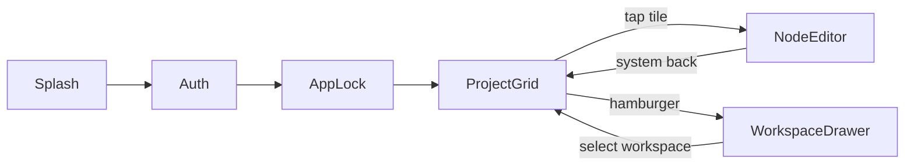

> **Status: Proposal**: undecided (checklist G2). Not maintained.

# ActionStation KMP Mobile Apps — Implementation Plan

## Repo layout recommendation (your question)

Products with a web app + native mobile apps typically choose among three patterns:

| Pattern | Who uses it | Fit for ActionStation |
|---------|-------------|----------------------|
| **Monorepo** (`web/` + `mobile/` in one repo) | Early-stage products, small teams (Notion early, many startups) | **Best for v1** — Firestore schema, security rules, and Cloud Functions live here already |
| **Separate repos** | Large orgs with distinct mobile/web teams and independent release trains | Better later, when mobile has its own release cadence and dedicated owners |
| **Hybrid: shared contracts package** | Mature products needing strict API parity (Stripe-style SDK repos, protobuf/JSON Schema) | Overkill now; consider when you have 3+ clients |

**Why monorepo wins for ActionStation today**

- The real contract is **Firestore document shape**, not shared TypeScript/Kotlin code. Schema changes in [`firestore.rules`](firestore.rules), [`workspaceService.ts`](src/features/workspace/services/workspaceService.ts), and [`node.ts`](src/features/canvas/types/node.ts) should land in the **same PR** as mobile serializer updates.
- Your team is building one product with two surfaces. A `mobile/` folder avoids artifact publishing, version skew, and duplicate issue tracking.
- CI can stay simple: web `npm run check` + mobile `./gradlew :shared:check` in one workflow.
- **Escape hatch**: when mobile matures, move `mobile/` to `actionstation-mobile` with zero backend change. Firebase is already the integration boundary.

**Proposed structure** (new, no changes to existing web paths):

```
Action Station/
├── src/                    # existing web app (unchanged)
├── functions/              # existing Cloud Functions (unchanged)
└── mobile/
    ├── composeApp/         # Android + iOS UI (Compose Multiplatform)
    ├── shared/             # KMP commonMain: models, repos, use cases
    ├── androidApp/         # Android entry + manifest
    └── iosApp/             # Xcode wrapper for iOS
```

---

## Product mapping: web concepts → mobile screens

The web app has **no separate dashboard**. Authenticated "home" is [`Layout.tsx`](src/app/components/Layout.tsx) + [`CanvasView.tsx`](src/features/canvas/components/CanvasView.tsx). Mobile reinterprets this as a **tile grid**, not an infinite pan/zoom canvas.



| Your requirement | Web reference | Mobile implementation |
|------------------|---------------|----------------------|
| Splash | [`manifest.json`](public/manifest.json) branding | Compose splash; reuse `favicon.svg` / PWA icons |
| Google auth | [`authService.ts`](src/features/auth/services/authService.ts) | Firebase Auth + native Google Sign-In (bypasses web Turnstile in [`LoginPage.tsx`](src/features/auth/components/LoginPage.tsx)) |
| PIN / screen lock | **Not in web** (only sidebar/node/canvas lock) | New: biometric + optional 4–6 digit PIN via `EncryptedSharedPreferences` / iOS Keychain |
| Home screen | Canvas + dotted grid ([`BackgroundVariant.Dots`](src/features/canvas/components/CanvasView.tsx)) | `ProjectGridScreen`: 2-column masonry tiles on dotted background |
| Remember last project | [`lastWorkspaceService.ts`](src/features/workspace/services/lastWorkspaceService.ts) | DataStore / `NSUserDefaults` key `last-workspace-id` |
| Hamburger menu | Web uses hover/pin [`Sidebar.tsx`](src/shared/components/Sidebar.tsx) | `ModalNavigationDrawer` listing workspaces from [`WorkspaceList.tsx`](src/app/components/WorkspaceList.tsx) pattern |
| Node tiles | Collapsed card = heading only ([`IdeaCard.tsx`](src/features/canvas/components/nodes/IdeaCard.tsx) `isCollapsed`) | **Presentation-only** small tiles (do not force-toggle `isCollapsed` in Firestore) |
| Expanded node | Focus/edit mode | Full-screen `NodeEditorScreen` |
| Bottom toolbar | [`NodeHoverMenu.tsx`](src/features/canvas/components/nodes/NodeHoverMenu.tsx) (mouse proximity) | Fixed bottom `NodeActionBar` |
| Back to project | N/A on mobile | System back → grid |

**v1 toolbar scope (your choice: minimal capture)**

- New node
- Edit heading + body (markdown)
- Camera / photo upload
- Tags
- Delete

Explicitly **out of v1**: AI generate, connect/edges UI, synthesis, knowledge bank, calendar, payments, mindmap view, clustering, public share links, workspace templates.

---

## Technical stack

| Layer | Choice | Rationale |
|-------|--------|-----------|
| UI | **Compose Multiplatform** (Material 3) | One UI codebase for Android + iOS; matches minimalist scope |
| Shared logic | **KMP `shared` module** (`commonMain`) | Models, repositories, use cases, serialization |
| Firebase | **GitLive Firebase KMP** (Auth, Firestore, Storage) | Mature KMP support; evaluate official Firebase Kotlin SDK at scaffold time |
| Local cache / offline | **SQLDelight** in `shared` | Offline write queue mirroring web [`offlineQueueStore`](src/features/workspace/stores/offlineQueueStore.ts) |
| DI | **Koin** (KMP-friendly) | Lightweight, works in commonMain |
| Navigation | **Compose Navigation** | Splash → Auth → Lock → Main graph |
| Rich text | **Markdown** in `data.output` | Web stores TipTap markdown via [`useTipTapEditor.getMarkdown`](src/features/canvas/hooks/useTipTapEditor.ts) — mobile must read/write same field |
| App lock | `androidx.biometric` + iOS `LocalAuthentication` | New platform code in `androidMain` / `iosMain` |
| Images | Firebase Storage paths from [`imageUploadService.ts`](src/features/canvas/services/imageUploadService.ts) | `users/{uid}/workspaces/{wsId}/nodes/{nodeId}/images/{fileName}` |

---

## Shared domain layer (port from web)

Mirror these web modules into `mobile/shared/src/commonMain/kotlin/`:

### 1. Data models (must match Firestore)

Source of truth:

- [`Workspace`](src/features/workspace/types/workspace.ts) — `workspace-{uuid}` IDs
- [`CanvasNode` / `IdeaNodeData`](src/features/canvas/types/node.ts) — `idea-{uuid}` IDs, `heading`, `output` (markdown), `tags`, `colorKey`, etc.
- [`CanvasEdge`](src/features/canvas/types/edge.ts) — load for parity; **no edge editing in v1**

Use `@Serializable` + custom Firestore timestamp adapters. Add **contract tests**: deserialize golden JSON fixtures exported from web test data.

### 2. Firestore repositories

Port logic from [`workspaceService.ts`](src/features/workspace/services/workspaceService.ts):

| Operation | Firestore path | Notes |
|-----------|----------------|-------|
| List workspaces | `users/{uid}/workspaces` + `limit(100)` | Same cap as [`WORKSPACE_LIST_CAP`](src/config/firestoreQueryConfig.ts) |
| Load nodes | `.../workspaces/{wsId}/nodes` + `limit(1000)` | Skip spatial tiles — feature not wired in web [`App.tsx`](src/App.tsx) anyway |
| Save nodes | Diff-based upsert/delete | Port `saveNodes()` transaction/batch rules (≤500 txn, else chunked) |
| Create node | `appendNode()` pattern | [`createIdeaNode`](src/features/canvas/types/node.ts) + grid placement |
| Update nodeCount | `updateWorkspaceNodeCount` | Keep web sidebar counts accurate |

**Do not port**: `tabLeaderService`, `workspaceBundle` (optional optimization later), spatial chunking (`tiledNodeWriter`).

### 3. Migrations

Port [`migrationRunner.ts`](src/migrations/migrationRunner.ts) (`CURRENT_SCHEMA_VERSION = 3`) — run on workspace/node load before display/save.

### 4. Sanitization

Port [`stripBase64Images`](src/shared/utils/contentSanitizer.ts) — mandatory before every Firestore write (web structural test enforces this).

### 5. Grid placement for new nodes

Port [`gridLayoutService.ts`](src/features/canvas/services/gridLayoutService.ts) + constants, but use **2 columns** on phone (web uses `GRID_COLUMNS = 4`). Write real `position.x/y`, `width`, `height` so nodes appear correctly on web canvas.

### 6. Autosave

Mirror [`useAutosave.ts`](src/features/workspace/hooks/useAutosave.ts): **2s debounce** after edits; flush on workspace switch (port [`useWorkspaceSwitcher.ts`](src/features/workspace/hooks/useWorkspaceSwitcher.ts) queue pattern).

### 7. Tier guards (read-only)

Port free-tier node cap check from [`useNodeCreationGuard`](src/features/subscription/hooks/useNodeCreationGuard.ts) — toast/snackbar when `nodeCount >= 12`. No payment UI in v1.

---

## Firebase / backend prep (no web code changes required for v1)

Register native apps in Firebase Console (`actionstation-244f0`):

1. **Add Android + iOS apps** → download `google-services.json` / `GoogleService-Info.plist`
2. **App Check**: Play Integrity (Android) + App Attest/DeviceCheck (iOS) — web uses reCAPTCHA v3 in [`firebase.ts`](src/config/firebase.ts); native needs separate providers or Firestore writes fail once enforcement is on
3. **Google Sign-In OAuth clients**: Android SHA-1 + iOS URL scheme (separate from web `VITE_GOOGLE_CLIENT_ID` calendar client)
4. **Turnstile**: Native auth **does not** go through [`verifyTurnstile`](functions/src/index.ts) — no blocker
5. **Bot detector**: HTTP clients must send a normal `User-Agent` ([`botDetector.ts`](functions/src/utils/botDetector.ts)) — relevant only if v2 adds `geminiProxy` calls

Document these steps in a short `mobile/README.md` (setup only, not a full doc dump).

---

## Screen-by-screen build plan

### Phase 0 — Scaffold (week 1)

- Create `mobile/` Gradle project (KMP + CMP + GitLive Firebase)
- Wire Firebase config for debug/release
- App Check debug tokens for local dev
- CI job: `./gradlew :shared:allTests :composeApp:compileKotlinIosArm64`

### Phase 1 — Auth + App Lock (week 1–2)

- `SplashScreen` → check auth session
- `GoogleSignInScreen` (Firebase Auth)
- `AppLockScreen`: enable/disable in settings; biometric first, PIN fallback; re-prompt on resume after 60s background (configurable)
- Persist lock preference locally only (not Firestore)

### Phase 2 — Workspaces (week 2)

- `WorkspaceDrawer`: list from Firestore, sorted by `orderIndex`
- Switch workspace + persist [`last-workspace-id`](src/features/workspace/services/lastWorkspaceService.ts)
- Show dividers as non-selectable separators (read-only, matching web)
- Sign out in drawer footer

### Phase 3 — Project grid (week 3)

- `ProjectGridScreen`: dotted background + `LazyVerticalGrid` (2 cols)
- Each tile: `heading` (or "Untitled"), optional color chip from `colorKey`
- FAB or top bar **+** → create node at next grid slot
- Pull-to-refresh sync from Firestore

### Phase 4 — Node editor + save (week 3–4)

- `NodeEditorScreen`: heading `TextField` + body markdown editor (basic formatting: bold/italic/lists sufficient for v1)
- Autosave debounced writes to `nodes/{nodeId}`
- Load existing `output` markdown from web-created nodes

### Phase 5 — Capture actions (week 4)

- **Camera / gallery** → upload to Storage → insert markdown image URL into `output` (same pattern as web [`imageUploadService`](src/features/canvas/services/imageUploadService.ts))
- **Tags** bottom sheet (read/write `data.tags[]`)
- **Delete** with confirmation → remove Firestore doc + decrement `nodeCount`

### Phase 6 — Offline + polish (week 5)

- SQLDelight queue for pending saves when offline
- Error banners for sync failures
- Empty states, loading skeletons
- Strings: mirror namespaces from [`strings.ts`](src/shared/localization/strings.ts) for `workspace`, `canvas`, `nodeUtils`, `auth` (Kotlin `StringResources`)

### Phase 7 — Store release (week 6)

- Play Store + App Store listings ("ActionStation Capture" or "ActionStation")
- Privacy policy link to existing [`PrivacyPolicy`](src/features/legal/PrivacyPolicy.tsx) route
- Beta via TestFlight + Play Internal Testing

---

## Web ↔ mobile compatibility rules

1. **Never write `data:image/...;base64`** to Firestore — upload to Storage first
2. **ID format**: `idea-${uuid}`, `workspace-${uuid}` via `crypto` equivalent (`randomUUID()`)
3. **Do not toggle `isCollapsed`** on mobile navigation — avoids surprising web users
4. **Edges**: load silently; if user deletes a node, web handles orphan edges (or port `onNodeDeleted` trigger behavior — server already cleans Storage)
5. **Schema version**: always set `schemaVersion: 3` on writes
6. **Concurrent edits**: last-write-wins on field level (acceptable for v1 capture app); web autosave + mobile autosave may conflict — show "Updated elsewhere" snackbar if `updatedAt` changes under editor (simple optimistic lock)

---

## What stays web-only (by design)

| Feature | Reason |
|---------|--------|
| Synthesis, clustering, KB | "Web is where synthesis happens" |
| Infinite canvas pan/zoom | Mobile uses grid; positions still sync |
| TipTap bubble menu / slash commands | v1 markdown editor only |
| Payments / upgrade walls | Show limit message; link to web for upgrade |
| Calendar, document agent | Not capture |
| Multi-tab leader election | Single mobile instance |

---

## Risk register

| Risk | Mitigation |
|------|------------|
| App Check blocks Firestore | Register native apps + debug tokens before first integration test |
| Markdown rendering differences | Golden-file tests: web TipTap markdown → mobile parser |
| Image upload race + autosave | Port `stripBase64Images` + upload-then-save sequencing from web |
| iOS Compose maturity | Target iOS 16+; keep `iosApp` thin; test on device early in Phase 0 |
| Schema drift | Monorepo + contract tests; bump `CURRENT_SCHEMA_VERSION` in both codebases |

---

## Success criteria (v1 done)

- User signs in with Google on Android and iOS
- App lock works (biometric or PIN)
- Opens last-used workspace
- Sees all nodes as tappable tiles on dotted grid
- Taps node → edits heading/body → autosaves to Firestore
- Adds photo via camera; web shows node with image in same workspace
- Creates/deletes nodes; web reflects changes within seconds
- Free-tier node limit enforced with clear message
